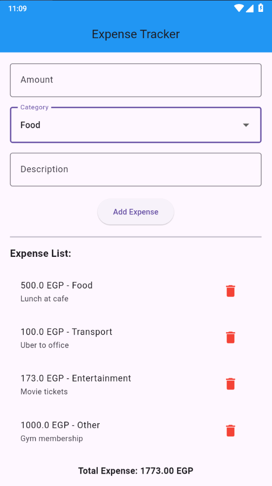

# Expense Tracker

A Flutter application for tracking daily expenses with persistent local storage using Hive.

## Screenshot



## Features

- ✅ Add, view, and delete expenses
- ✅ Categorize expenses (Food, Transport, Entertainment, Other)
- ✅ Add descriptions for each expense
- ✅ Calculate total expenses automatically
- ✅ Persistent storage using Hive (data survives app restart)
- ✅ Clean, modular code structure with widget extraction
- ✅ Input validation and error handling

## Tech Stack

- **Framework:** Flutter
- **Language:** Dart
- **Local Storage:** Hive
- **State Management:** setState

## Project Structure
```
lib/
├── models/
│   └── expense.dart        # Expense data model
├── screens/
│   └── home_screen.dart    # Main screen
├── widgets/
│   ├── expense_form.dart   # Input form widget
│   └── expense_list.dart   # Expense list widget
└── main.dart               # App entry point
```

## How to Use

1. **Add Expense:** Fill in amount, category, and description, then tap "Add Expense"
2. **View Expenses:** See all expenses in the list with total calculation
3. **Delete Expense:** Swipe or tap the delete icon to remove an expense
4. **Data Persistence:** All expenses are automatically saved to device storage

## Installation
```bash
flutter pub get
flutter run
```

## Future Improvements

- Add expense filtering by category
- Add date range filtering
- Add charts/statistics
- Add budget limits
- Add expense editing functionality